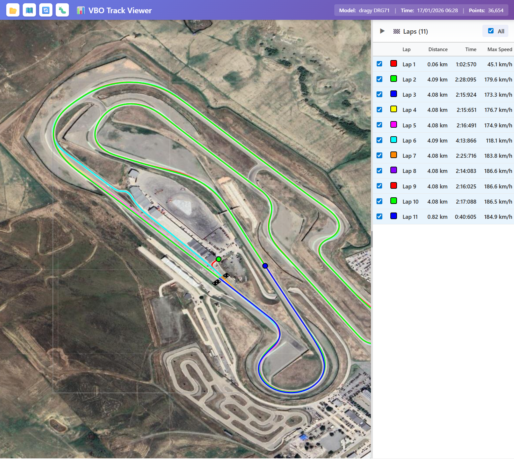

# 🏁 Track Tools

A professional GPS track visualization tool for VBO files. Built with React, TypeScript, and Vite.



## ✨ Features

- 🗺️ **GPS Track Visualization** - Display tracks on Google Maps satellite imagery
- 🏁 **Automatic Lap Detection** - Intelligent start/finish line detection with precise lap splitting
- 🎨 **Multi-Lap Support** - Each lap rendered in different color (up to 32 laps)
- 🔍 **Interactive Controls** - Mouse wheel zoom, drag to pan
- 📊 **Lap Statistics** - Distance, time (MM:SS:mmm format), and max speed for each lap
- 🐛 **Debug Mode** - Visualization of detection lines and vectors
- ⚡ **High Performance** - Handles large files with 30-50k GPS points
- 📐 **Metric Coordinate System** - Precise calculations using meters-based coordinate system

## 🚀 Quick Start

### Install Dependencies

```bash
npm install
```

### Run Development Server

```bash
npm run dev
```

The application will open at [http://localhost:5174](http://localhost:5174)

### Build for Production

```bash
npm run build
```

### Preview Production Build

```bash
npm run preview
```

## 📝 How to Use

1. Click the 📂 **Open File** button in the top toolbar
2. Select a `.vbo` file
3. The track will be displayed on the map with automatic lap detection
4. Use the right panel to toggle lap visibility
5. Mouse wheel to zoom, drag to pan
6. Click ⚙️ for settings and debug information

## 🛠 Technologies

- **React 18** - UI library
- **TypeScript** - Type-safe JavaScript
- **Vite** - Fast build tool
- **HTML5 Canvas** - High-performance rendering
- **Google Maps API** - Satellite imagery tiles

## 📦 Project Structure

```
track_anal/
├── src/
│   ├── components/
│   │   ├── TrackVisualizer.tsx     # Main visualization component
│   │   ├── TrackVisualizer.css     # Visualization styles
│   │   ├── LapsPanel.tsx           # Lap list sidebar
│   │   └── LapsPanel.css           # Lap panel styles
│   ├── utils/
│   │   ├── vboParser.ts            # VBO file parser
│   │   └── tiles.ts                # Map tiles loader
│   ├── App.tsx                      # Main application
│   ├── App.css                      # Global styles
│   └── main.tsx                     # Entry point
├── test_data.vbo                    # Sample VBO file
└── package.json                     # Dependencies
```

## 🔬 Technical Details

### Coordinate Systems

The application uses three coordinate systems:

1. **GPS Coordinates** (lat/long) - Original data format
2. **Metric Coordinates** (x, y in meters) - Used for precise calculations
3. **Canvas Coordinates** - Screen pixels for rendering

Conversion functions ensure accurate transformations between systems.

### Lap Detection Algorithm

1. Detect start/finish line at maximum velocity point
2. Calculate detection segment (perpendicular to direction, width = 40m)
3. Check each trajectory segment for intersection with detection segment
4. On intersection: create interpolated point, split lap
5. Minimum 50 points per lap to avoid false positives

### VBO File Format

Supported format: dragy VBO files

- GPS coordinates in angular minutes
- Velocity, heading, altitude data
- Time-stamped points

## 💡 Useful Commands

- `npm run dev` - Start development server
- `npm run build` - Build for production
- `npm run preview` - Preview production build

## 🎯 Keyboard Shortcuts

- **Mouse Wheel** - Zoom in/out
- **Mouse Drag** - Pan the view
- **Click 🔄** - Reset view to default

## 📄 License

See [LICENSE](LICENSE) file for details.
